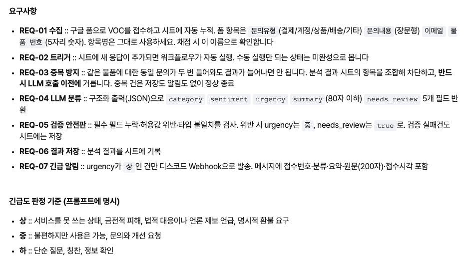

# 20260806_고객_voc_agent_with_n8n
> **Google Form → Google Sheet → n8n → LLM 분류 → 검증 → 시트 저장 → 디스코드 긴급 알림으로 이어지는 VOC(고객 문의) 자동 분류 워크플로우를 설계하고 디버깅**

---
## 요구사항


## 전체 파이프라인 구성

```text
Google Form 제출
      │
      ▼
Google Sheet (원본 응답)
      │  (Row Added, 폴링 트리거)
      ▼
필드 정규화
      │
      ▼
분석결과 시트 조회 ── 중복 판정 + 접수번호 생성
      │                        │
      │                  ┌─────┴─────┐
      │                true(중복)   false(신규)
      │                  │           │
      │                종료      AI Agent (LLM 분류)
      │                            │
      │                      검증 안전판
      │                            │
      │                     분석 결과 저장(Append)
      │                            │
      │                      urgency === '상' ?
      │                        │        │
      │                     Discord    종료
```

---
## 단계별 흐름
### 1. 폼 제출 (트리거)

구글 시트 "원본 응답" 시트에 행이 추가되면 매분 감지하여 워크플로우 시작.

### 2. 필드 정규화

한글 컬럼명(문의유형, 문의내용, 이메일, 물품번호, 타임스탬프)을 영문 변수(inquiry_type, inquiry_body, email, item_no, received_at)로 매핑. 타임스탬프를 yyyy-MM-dd HH:mm 형식으로 변환.

### 3. 분석결과 시트 조회

"VOC_분석결과" 시트 조회. 기존 데이터와 비교 준비.

### 4. 중복 판정 + 접수번호 생성 (Code 노드)

오늘 날짜(VOC-YYYYMMDD-) 기준 접수번호 중 최댓값 조회. 다음 번호 생성. 물품번호와 원문이 기존 행과 동일하면 isDuplicate: true 설정. 접수번호(voc_id) 미발급.

### 5. If (중복 필터)

isDuplicate가 true이면 워크플로우 종료. false이면 AI Agent 실행.

### 6. AI Agent (Gemini + Structured Output Parser)

문의유형과 문의내용 분석. category, sentiment, urgency, summary, needs_review 5개 필드 생성. 시스템 프롬프트에 허용값과 긴급도 판단 기준 적용.

### 7. 검증 안전판 (Code 노드)

AI 출력값 검증. 허용값 이탈, summary 누락, 80자 초과, 타입 오류 발생 시 기본값으로 보정. needs_review를 true로 변경.

### 8. 분석 결과 저장

"VOC_분석결과" 시트에 접수번호, 접수시각, 이메일, 물품번호, 고객선택유형, AI 분류결과, 원문 저장.

### 9. 긴급도 분기 (If)

urgency === "상"이면 Discord 웹훅으로 즉시 알림 전송. 그렇지 않으면 워크플로우 종료.

## 트러블 슈팅
### 1. 노드 출력이 0개면 워크플로우가 멈춘다

`분석결과 시트조회`(Get Row(s))가 조회 결과 0건을 반환하면, n8n은 기본적으로 **그 뒤 노드 전체 실행을 중단**한다. "첫 문의라 비교 대상이 없는" 정상적인 상황인데도 파이프라인이 멈춰버렸다.

- **해결**: 해당 노드 `Settings → Always Output Data` 옵션 ON → 0건이어도 빈 배열이 다음 노드로 전달됨
---

### 2. 트리거가 여러 행을 한 번에 묶어서 줄 수 있다

Google Sheets Trigger는 폴링 방식이라, 폴링 주기 사이에 여러 응답이 쌓이면 **한 실행에 N개의 아이템이 동시에** 들어온다. 처음에는 "1건짜리 데이터"만 가정하고 `.item`(단수)으로 코드를 짜서, 배치가 2건 이상이 되는 순간 첫 번째 아이템 데이터만 계속 재사용되는 버그가 났다.

- **해결**: `.item` 대신 `$('노드명').all()`로 배치 내 모든 아이템을 순회하도록 코드 작성
---
### 3. Code 노드의 실행 모드(Mode)에 따라 문법이 완전히 다르다

| Mode | 입력 접근 | 반환 방식 |
|---|---|---|
| `Run Once for All Items` | `$input.all()` | `return [ {json:{...}}, ... ]` (배열) |
| `Run Once for Each Item` | `$input.item` | `return { json: {...} };` (단일 객체, 배열 아님) |
`$input.first()`를 `Each Item` 모드에서 쓰면 에러가 나고, 반대로 `Each Item` 모드에서 배열로 감싸서 반환(`return [{json:...}]`)해도 `A 'json' property isn't an object` 에러가 난다. 두 모드의 문법을 섞어 쓰면서 여러 번 삽질했다.
---
### 4. LLM 구조화 출력 + 검증 안전판

Structured Output Parser로 스키마를 강제하면 LLM이 허용값을 벗어나는 일은 거의 없다. 그래서 검증 로직(필수 필드/허용값/타입 체크 후 안전 기본값으로 보정)을 **정상 플로우로는 테스트할 수 없고**, 검증 노드 앞에 가짜 위반 데이터를 Pin Data로 직접 주입해서 단위 테스트하듯 확인해야 했다.

- 스키마 위반은 잘 안 나지만, **입력이 비어있는데도 LLM이 그럴듯한 값을 지어내는 환각**은 스키마 준수 여부와 무관하게 발생한다.
- 대응: (1) 폼 자체의 필수 입력 설정으로 원천 차단, (2) LLM 호출 전 코드에서 빈 값/짧은 입력을 걸러내는 가드 추가, (3) 프롬프트에 "빈 입력이면 이렇게 응답하라"는 예외 규칙 명시. 이 세 겹을 같이 둬야 실질적으로 신뢰할 수 있다.
---
### 5. 접수번호 생성 — count 방식의 함정

"오늘 날짜 접두사를 가진 행 개수 + 1"로 순번을 매기면, 중간에 번호가 비어있는 경우(예: 5번까지 있는데 실제 행은 2개뿐인 상황) 번호가 충돌할 수 있다.

- **해결**: 기존 접수번호 문자열에서 숫자를 파싱해 **최댓값 + 1**로 발급하도록 변경
---
### 6. "Execute Workflow" 수동 실행과 실제 Active 트리거는 다르게 동작한다

폴링 트리거(Row Added)는 "어디까지 처리했는지"를 Active 상태에서만 안정적으로 추적한다. 워크플로우를 Active로 켜지 않고 캔버스에서 "Execute Workflow"로 반복 테스트하면, 같은 행이 계속 "새 행"처럼 재처리되어 중복 판정이 꼬인 것처럼 보이는 현상이 있었다.

- **결론**: 개별 노드 로직 디버깅은 수동 실행 + Pin Data로, **트리거~전체 흐름 검증은 반드시 Active 상태 + 실제 폼 제출**로 해야 신뢰할 수 있다.

---
